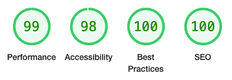
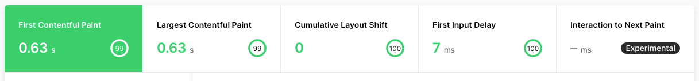

# nelo.dev

[](https://astro.build)

<br />

## Web Vitals Results

### Lighthouse



### Vercel Analytics



<br />

## Tech Stack

- **Framework**: [Astro](https://astro.build/)
- **Deployment**: [Vercel](https://vercel.com)
- **Styling**: [Tailwind CSS](https://tailwindcss.com)

## Running Locally

This application requires Node.js v18.14.0+.

```bash
git clone https://github.com/nelodev/nelo.dev.git
cd nelo.dev
npm install
npm start
```
